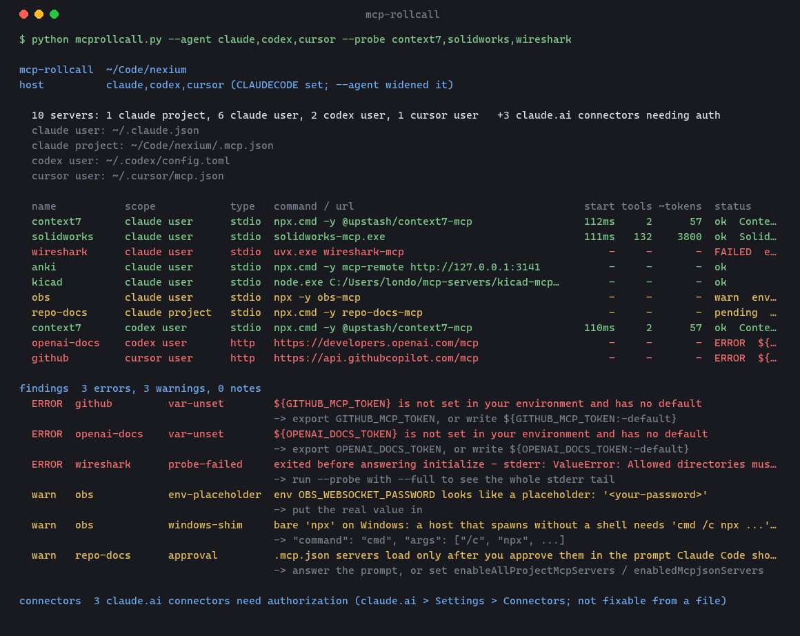

<div align="center">

# 🔌 mcp-rollcall

**Take a roll call of your MCP servers — which will fail to connect, exactly why, and what each one costs.**

[](https://github.com/Londopy/mcp-rollcall/actions/workflows/ci.yml)
[](LICENSE)
[](https://www.python.org/)
[](skills/mcp-rollcall/scripts/mcprollcall.py)
[](https://code.claude.com/docs/en/plugins)
[](#install)



<sub>Part of the rollcall family — tools that make what Claude Code does silently legible: [skill-rollcall](https://github.com/Londopy/skill-rollcall) · **mcp-rollcall** · [settings-effective](https://github.com/Londopy/settings-effective) · [git-attribution](https://github.com/Londopy/git-attribution)</sub>

</div>

---

Claude Code says `anki (CONNECTION_CLOSED)` and moves on. Was it the command? A path? An env var? The app it bridges to isn't running? The server threw on startup? The harness saw the answer — it read the stderr, it got the exit code — and discarded it.

`mcp-rollcall` reads every place a server can be configured, checks each one the way the harness would try to start it, and on request actually starts it, does the MCP handshake, and shows you what came back: the tool list, the startup time, the context cost, or the traceback. It runs as a skill (`/mcp-rollcall`, or just say "why did anki fail to connect") and as a plain CLI.

## What it does

| Mode | Question it answers |
|---|---|
| default (static, fast, touches nothing) | What's configured, where, and which of it can't work: command not on PATH, `.js` or directory in `args` that doesn't exist, `${VAR}` unset, empty or placeholder token, bare `npx` on Windows, same name in two scopes (which wins), `.mcp.json` server awaiting approval, blocked by `deniedMcpServers`. And for every URL — `type: http`, or an `mcp-remote` bridge in `args` — a TCP check: **nothing listening on 127.0.0.1:3141**. |
| `--probe [names]` | Spawns each stdio server with its env, sends `initialize` and `tools/list`, terminates it. Reports start ms, tool count, **~tokens of tool definitions loaded every session**, server name/version — or the exit code and **the last 40 lines of stderr**. |
| `--strict --no-net` | Is this `.mcp.json` sane before I commit it? Non-zero exit for CI. |

Only `--probe` starts anything. It never writes a config file.

## Install

Pick whichever fits how you manage skills; all three produce the same result.

**`skills` CLI** (global; `--copy` because symlinks need Developer Mode on Windows):

```bash
npx skills add Londopy/mcp-rollcall -g --copy
```

**Claude Code plugin** (in an interactive `claude` session):

```
/plugin marketplace add Londopy/mcp-rollcall
/plugin install mcp-rollcall@mcp-rollcall
```

**By hand:**

```bash
git clone https://github.com/Londopy/mcp-rollcall
cp -r mcp-rollcall/skills/mcp-rollcall ~/.claude/skills/
```

## Usage

### From Claude

Say what you'd naturally say — "why did wireshark fail to connect?", "what MCP servers do I have?", "which servers are eating my context?", "is this .mcp.json OK?" — or type `/mcp-rollcall`. Claude runs the static pass, probes the server you asked about if it's still unexplained, quotes the stderr line that matters, and tells you the fix. It won't edit `~/.claude.json` for you (the running app rewrites that file); it gives you the `claude mcp add` line instead.

### As a CLI

Stdlib-only Python, nothing in it depends on Claude:

```bash
python ~/.claude/skills/mcp-rollcall/scripts/mcprollcall.py
python ~/.claude/skills/mcp-rollcall/scripts/mcprollcall.py --probe wireshark --full
python ~/.claude/skills/mcp-rollcall/scripts/mcprollcall.py --probe            # everything, 4 at a time
```

| Flag | Effect |
|---|---|
| `--probe [a,b]` | Spawn and handshake every stdio server, or just these |
| `--timeout N` | Seconds to wait for `initialize` (default 20; first `npx -y` / `uvx` runs download) |
| `--jobs N` | Parallel probes (default 4) |
| `--project DIR` | Project whose `.mcp.json` and local servers count (default: cwd, walking up to a `.mcp.json` / `.claude/` / git root) |
| `--no-net` | Skip TCP reachability checks |
| `--no-plugins` | Skip plugin `.mcp.json` files |
| `--problems-only` | Findings only |
| `--full` | Untruncated commands, every tool name, the whole stderr tail |
| `--strict` | Exit 1 on any error |
| `--json` | Machine-readable |

Sources it reads: `~/.claude.json` → `mcpServers` (user) and `projects[<dir>].mcpServers` (local), `<project>/.mcp.json` (project, with `enabledMcpjsonServers` / `disabledMcpjsonServers` / `enableAllProjectMcpServers` from settings and the project entry), `managed-mcp.json` and `managedMcpServers` (managed), any `.mcp.json` in `~/.claude/plugins` (plugin), and `~/.claude/mcp-needs-auth-cache.json` for the claude.ai connectors awaiting authorization.

## What it catches

| Finding | Severity | Example | Fix it prints |
|---|---|---|---|
| `command-missing` | error | `uvx` not installed | install uv, or use the full path |
| `arg-path-missing` | error | `dist/index.js` moved | — |
| `var-unset` | error | `${OBSIDIAN_VAULT}` with no default | `export` it, or `${VAR:-default}` |
| `port-closed` | error | `mcp-remote http://127.0.0.1:3141` and Anki isn't open | start the app that hosts it |
| `probe-failed` | error | `ValueError: Allowed directories must already exist` | the stderr tail |
| `windows-shim` | warn | `"command": "npx"` on Windows | `cmd /c npx …` or `npx.cmd` |
| `env-empty` / `env-placeholder` | warn | `"TOKEN": "<your-token>"` | — |
| `shadowed` | warn | `filesystem` in both user and local scope | remove or rename one |
| `approval` | warn | `.mcp.json` server not yet approved | answer the prompt, or `enableAllProjectMcpServers` |
| `slow-start` | warn | 6 s to initialize, every session | pre-install instead of `npx -y` |
| `no-tools` | warn | connected, exposes nothing | — |
| `heavy` | note | 132 tools, ~36 k tokens per session | your call |
| `env-path` | note | `env.PATH` overrides the server's PATH | — |

## How the probe works

Same thing the harness does at session start, with the output kept: spawn `command args` with `env` merged over yours, write `{"method":"initialize"}` then `notifications/initialized` then `{"method":"tools/list"}` as newline-delimited JSON-RPC on stdin, read stdout until each reply arrives, then `terminate()`. Time-to-`initialize` is the start column; `len(json.dumps(tools)) / 4` is the token estimate. Stderr is collected the whole time and the last 40 lines are kept.

A server that talks to a desktop app (Blender, Photoshop, SolidWorks) will log that it couldn't reach the app and *still* handshake — that's `ok`, and it's also what happens in the harness. The ones that refuse to start without their app are the ones that show as `FAILED` there too.

## Related, not overlapping

`claude mcp list` prints ✔ / ✘ per server with no reason; `/mcp` in a session reconnects and shows auth state. [`mcp-doctor`](https://github.com/frankxai/mcp-doctor) (npm) audits config across several agents and spawns servers for a health score, but doesn't surface stderr or count tools. [`skill-rollcall`](https://github.com/Londopy/skill-rollcall) and [`settings-effective`](https://github.com/Londopy/settings-effective) do this job for skills and settings.

## What it cannot do

- **It doesn't know each server's conventions.** A directory list a server splits on commas while your config uses semicolons passes every static check; only the probe catches it (that one was real).
- **It doesn't authenticate.** An HTTP server behind OAuth gets a TCP check, not a handshake; the claude.ai connectors are listed from the cache, and their fix is in claude.ai's connector settings.
- **A probe that passes here can still fail in the harness** if the harness runs with a different PATH or environment than your shell. The report prints the exact command so you can compare.
- **Plugin servers** are found by scanning the plugin cache for `.mcp.json`; that's best-effort.
